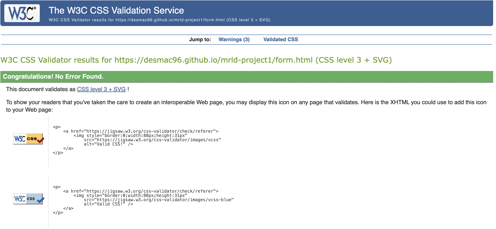

 <h1>MRLD</h1>
    
MRLD is an electronic music hub offering a variety of services. The website offers DJ services to hire, equipment to rent, mixing engineers, and also a school teaching students about various electronic music topics.

    
The website provides information about the services offered and also offers a form where you can sign up for courses and ask any questions. You need to provide your full name, email address, and mobile phone number to fill in the form.

    
When signing up, you are given the option of signing up for the newsletter by clicking on the checkbox provided. The website provides external links to all MRLD's social media pages. There is also a mixes page that has embedded SoundCloud links.

    
    <h2>Table of Contents</h2>
    <ul>
        <li><a href="#existing-features">Existing Features</a></li>
        <li><a href="#user-goals">User Goals</a></li>
        <li><a href="#design">Design</a></li>
        <li><a href="#technologies-used">Technologies Used</a></li>
        <li><a href="#frameworks-libraries-programs-used">Frameworks, Libraries & Programs Used</a></li>
        <li><a href="#testing">Testing</a></li>
        <li><a href="#deployment">Deployment</a></li>
        <li><a href="#credits">Credits</a></li>
    </ul>
    <h2 id="existing-features">Existing Features</h2>
    <h3>Logo</h3>
    
The logo is situated in the top left-hand corner of the home page. The print is in white and is big and bold, immediately catching the user's eye and making it clear what website you are on. The logo is a clickable link that brings you to the home page, which is a common feature on all websites.

    <h3>Navigation Bar</h3>
    
The Navigation Bar contains three links:

    <ul>
        <li><strong>Home:</strong> Provides information about the services offered by MRLD.</li>
        <li><strong>Mixes:</strong> Contains embedded SoundCloud links to listen to MRLD's latest mixes.</li>
        <li><strong>Form:</strong> Takes you to the form page where you can sign up for any of the services that MRLD offers or ask a question.</li>
    </ul>
    <h3>Landing Page</h3>
    
The landing page has an eye-catching image. The image contains the MRLD logo and a crowd at a party. There is also information beneath the hero image informing the user of the services that MRLD offers.

    <h3>Mixes</h3>
    
The mixes' link is the second link on the nav bar. This page allows the user to listen to MRLD's radio show via the embedded SoundCloud player.

    <h3>Form</h3>
    
This section is the key section of the webpage. The form is on the right side of the nav bar. This is where the user provides their details and chooses what services they need.

    <h3>Footer</h3>
    
The footer section includes external links to all MRLD's social media pages. There are links to contact MRLD by email or phone call. Finally, there is a location symbol that brings you to MRLD's location on the maps. All these links are shown by a suitable symbol.

    <h2 id="user-goals">User Goals</h2>
    <h3>First Time Visitor Goals</h3>
    <ul>
        <li>As a first-time visitor, I'd like to easily understand the main purpose of the website and know what services are being offered.</li>
        <li>As a first-time visitor, I'd like to be able to easily navigate through the website and jump to each page with one click.</li>
        <li>As a first-time visitor, I'd like to be able to sign up for courses, hire a DJ, mix engineer, or equipment if I am interested in any of those services.</li>
    </ul>
    <h3>Returning Visitor Goals</h3>
    <ul>
        <li>As a returning visitor, I want to see all the necessary contact details.</li>
        <li>As a returning visitor, I want to find out where the courses will be held.</li>
        <li>As a returning visitor, I want to be able to sign up for a course if I have decided to join the academy.</li>
    </ul>
    <h3>Frequent User Goals</h3>
    <ul>
        <li>As a frequent user, I would like to be able to sign up for the newsletter to receive emails about upcoming courses and offers.</li>
        <li>As a frequent user, I would like to be able to click a link that brings me directly to MRLD's social media accounts.</li>
        <li>As a frequent user, I'd like to be inspired by the hero image.</li>
    </ul>
    <h2 id="design">Design</h2>
    <h3>Colour Scheme</h3>
    
The two main colours used are black and white. They work well with the colours in the hero image. Grey is used in the services section to create distinct sections that stand out against the black background. Green is also used for the sign-up form button to match the green in the hero image.

    <h3>Typography</h3>
    
The two fonts used on this website are Montserrat and Kanit. They were imported through Google Fonts. They are quite similar and work well together. Their style suits the kind of website MRLD needed. Sans Serif is the fallback font in case the custom fonts are not imported correctly. I got inspiration to use the Montserrat font from the PIV Records website.

    <h3>Imagery</h3>
    
Imagery is very important when building a website. The large background hero image is designed to catch the user's eye and also familiarize the user with the MRLD logo.

    <h2 id="technologies-used">Technologies Used</h2>
    <ul>
        <li>HTML5</li>
        <li>CSS3</li>
    </ul>
    <h2 id="frameworks-libraries-programs-used">Frameworks, Libraries & Programs Used</h2>
    <ul>
        <li><strong>Google Fonts:</strong> Google fonts were used to import the 'Montserrat' and 'Kanit' fonts into the style.css file which is used on all pages throughout the project.</li>
        <li><strong>Balsamiq:</strong> I used Balsamiq to create wireframes when planning the project.</li>
        <li><strong>Font Awesome:</strong> Font Awesome was used throughout the website to add icons for aesthetic and UX purposes.</li>
        <li><strong>Git:</strong> Git was used for version control by utilizing the Gitpod terminal to commit to Git and Push to GitHub.</li>
        <li><strong>GitHub:</strong> GitHub is used to store the project's code after being pushed from Git.</li>
    </ul>
    <h2 id="testing">Testing</h2>
    <ul>
        <li>The W3C Markup Validator and W3C CSS Validator Services were used to validate every page of the project to ensure there were no syntax errors in the project.</li>
        <li>The site was also tested using devtools Lighthouse. Here are the results:</li>
    </ul>
    
    
    
    
    <h3>Testing User Stories from User Experience (UX) Section</h3>
    <h4>First Time Visitor Goals</h4>
    <ul>
        <li>As a First Time Visitor, I want to easily understand the main purpose of the site and learn more about what services are being offered.</li>
        <li>Upon entering the site, the user is greeted with an easily readable navigation bar that links to each section of the page.</li>
        <li>Immediately you learn what services are being offered.</li>
        <li>The user has two options, click the call to action buttons or scroll down, both of which will lead to the same place, to learn more about the services being offered by MRLD.</li>
    </ul>
    <h4>Returning Visitor Goals</h4>
    <ul>
        <li>As a returning visitor, I want to find the best ways to contact MRLD.</li>
        <li>The navigation bar clearly highlights the "Contact Us" Page.</li>
        <li>The footer contains links to the organization's Facebook and Instagram page as well as the organization's email.</li>
        <li>The footer also contains the location of the studio and the company's mobile phone number.</li>
        <li>Whichever link they click, it will open up in a new tab to ensure the user can easily get back to the website.</li>
    </ul>
    <h4>Frequent User Goals</h4>
    <ul>
        <li>As a Frequent User, I want to sign up for the Newsletter so that I am emailed any major updates and/or changes to the website or organization.</li>
        <li>At the bottom of the form, there is a clickable checkbox. Ticking this checkbox signs the user up for the newsletter.</li>
        <li>There is a "Sign Up" button at the bottom of the form. Clicking this button after ticking the checkbox signs the user up for the newsletter.</li>
    </ul>
    <h3>Further Testing</h3>
    <ul>
        <li>The website was tested on Google Chrome, Internet Explorer, Microsoft Edge, and Safari browsers.</li>
        <li>The website was viewed on a variety of devices such as Desktop, laptop, tablets, and mobile phones.</li>
        <li>A large amount of testing was done to make sure all links are working correctly.</li>
        <li>Friends and family members were asked to review the site and documentation to point out any bugs and/or user experience issues.</li>
    </ul>
    <h3>Known Bugs</h3>
    <ul>
        <li>Originally I had planned to have the footer section in white. After struggling to change the text color to black for the footer section I decided to keep the footer section black with white text and to put the form within the section above it white, to break the page up.</li>
        <li>On mobile phone sizes the sign-up section of the navigation bar is slightly less visible.</li>
    </ul>
    <h2 id="deployment">Deployment</h2>
    <h3>GitHub Pages</h3>
    <ul>
        <li>1. Log in to GitHub and locate the GitHub Repository</li>
        <li>2. At the top of the Repository (not top of the page), locate the "Settings" Button on the menu.</li>
        <li>3. Scroll down the Settings page until you locate the "GitHub Pages" Section.</li>
        <li>4. Under "Source", click the dropdown called "None" and select "Main Branch"</li>
        <li>5. The page will automatically refresh.</li>
        <li>6. Scroll back down through the page to locate the now published site link in the "GitHub Pages" section.</li>
    </ul>
    <h3>Forking the GitHub Repository</h3>
    <ul>
        <li>By forking the GitHub Repository we make a copy of the original repository on our GitHub account to view and/or make changes without affecting the original repository by using the following steps...</li>
        <li>1. Log in to GitHub and locate the GitHub Repository</li>
        <li>2. At the top of the Repository (not top of page) just above the "Settings" Button on the menu, locate the "Fork" Button.</li>
        <li>3. You should now have a copy of the original repository in your GitHub account.</li>
    </ul>
    <h3>Making a Local Clone</h3>
    <ul>
        <li>1. Log in to GitHub and locate the GitHub Repository</li>
        <li>2. Under the repository name, click "Clone or download".</li>
        <li>3. To clone the repository using HTTPS, under "Clone with HTTPS", copy the link</li>
        <li>4. Open Git Bash</li>
        <li>5. Change the current working directory to the location where you want the cloned directory to be made.</li>
        <li>6. Type git clone, and then paste the URL you copied in Step 3.
            <pre>$ git clone https://github.com/YOUR-USERNAME/YOUR-REPOSITORY</pre>
        </li>
        <li>7. Press Enter. Your local clone will be created.
            <pre>$ git clone https://github.com/YOUR-USERNAME/YOUR-REPOSITORY
            Cloning into `CI-Clone`...
            remote: Counting objects: 10, done.
            remote: Compressing objects: 100% (8/8), done.
            remote: Total 10 (delta 1), reused 10 (delta 1)
            Unpacking objects: 100% (10/10), done.</pre>
        </li>
    </ul>
    <h2 id="credits">Credits</h2>
    <h3>Code</h3>
    <ul>
        <li>I used the Love Running project as a guide.</li>
    </ul>
    <h3>Content</h3>
    <ul>
        <li>All content was written by the developer.</li>
    </ul>
    <h3>Media</h3>
    <ul>
        <li>The hero image was created on Canva by myself.</li>
    </ul>
    <h3>Acknowledgements</h3>
    <ul>
        <li>My mentor for continuous helpful feedback.</li>
        <li>Tutor support at Code Institute for their support.</li>
    </ul>
